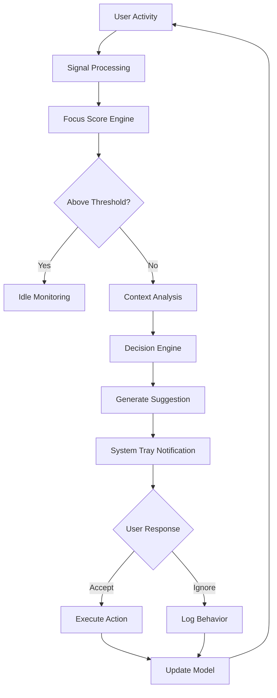

# 🚀 HumanOS
### *An operating system for your focus*

HumanOS is a lightweight background system that monitors behavioral signals and helps you maintain deep focus through intelligent, non-invasive suggestions.

---

## ⚙️ Core Idea

> Your computer manages hardware.  
> **HumanOS manages your attention.**

---

## 🔁 System Flow

```mermaid
flowchart TD
    A[User Activity] --> B[Signal Processing]
    B --> C[Focus Score Engine]
    C --> D{Above Threshold?}
    
    D -->|Yes| E[Idle Monitoring]
    D -->|No| F[Context Analysis]
    
    F --> G[Decision Engine]
    G --> H[Generate Suggestion]
    H --> I[System Tray Notification]
    
    I --> J{User Response}
    J -->|Accept| K[Execute Action]
    J -->|Ignore| L[Log Behavior]
    
    K --> M[Update Model]
    L --> M
    M --> A
```

---

## 🧠 Features
### 📊 Focus Tracking
- Keyboard activity (speed, consistency)
- Mouse movement patterns
- Window/app switching frequency
- Idle detection

---

### 🔋 Focus Battery
- Real-time score (0.0 → 1.0)
- Mapped to 5 visual states:
  - 🔴 Distracted
  - 🟠 Unstable
  - 🟡 Neutral
  - 🟢 Focused
  - 🔵 Flow

---

### 🔔 Smart Suggestions
- Context-aware (e.g., “Close YouTube?”)
- Delivered via system tray
- Designed to be:
  - Minimal
  - Optional
  - Non-annoying

---

### ⚡ Preemptive Intervention
- Detects decline trends, not just low scores
- Acts before productivity drops

---

### 🎯 Adaptive Learning
- Adjusts thresholds based on:
  - User acceptance rate
  - Time-of-day patterns
  - Focus session length

---

### 🔒 Privacy First
- ❌ No content tracking
- ❌ No keystroke logging
- ✅ Only behavioral metadata
- ✅ Fully local processing
