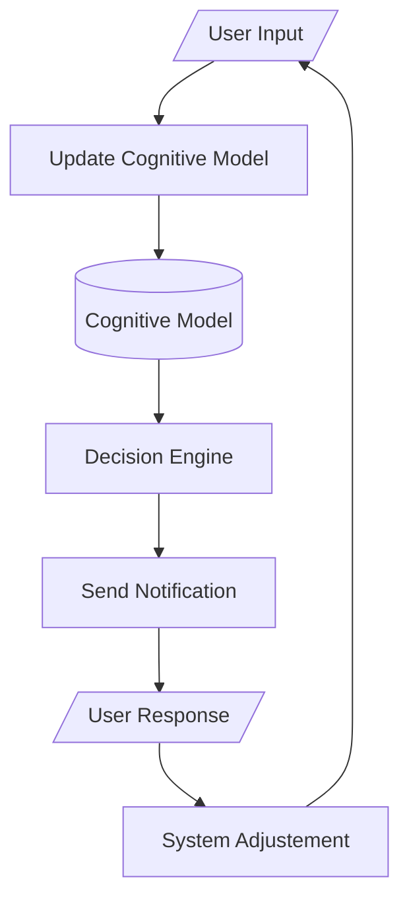

## **HumanOS**
##### An interface between the user and the machine.

Whereas a computer operating system manages computer's resources for the user to use efficiently, the HumanOS (Human Operating System) manages  the user's focus and emotions to use the computer more efficiently.

#### How It Works

Think of this operating system as a normal operating system except you are the hardware.

- The CPU is your brain.
- The RAM is your memory/attention.
- The Battery is your energy.

It is hard to manage your own resources when you can't always monitor your own focus or energy. That's where HumanOS comes in:

- It tracks your input/context.
- Makes a digital model of your cognitive state.
- Makes decisions based on your cognitive state.
- Sends you a suggestion on how to better manage your state.
- You choose to take action or not.
- The system adjusts to your choices.

It is important to note that this software is non-invasive, privacy first (never tracking input, searches, or messages), human-in-the-loop, and rules-based intellect, not AI.

Here's an example:

